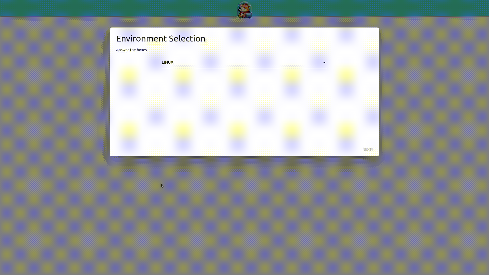

<p align="center">

## 🚀 Demo



## ✨ Features

Here're some of the project's best features:

*   Securing large IT infrastructures
*   Compliance with safety standards
*   Automated hardening
*   Cross-platform compatibility

## 🛠️ Installation Steps:

1. Retrieve the github project

```bash
git clone https://github.com/Autom-A/AutomA-WebUI
cd AutomA-WebUI 
```

2. Retrieve playbooks
```bash
git submodule update --init --recursive
```

2. Install python dependencies

```bash
pip3 install -r requirements.txt
```

3. Modify the configuration file

4. Run !

```bash
python3 wsgi.py
```

## 🍰 Contribution Guidelines:

We invite you to contribute to the project! We have detailed the contribution instructions in the [documentation](https://autom-a.github.io/developers_documentation/contribute/index.html).
  
## 💻 Built with

Technologies used in the project:


## 🛡️ License:

This project is licensed under the MIT

## 🌟 Want to support ?

[](https://www.buymeacoffee.com/mijux)

